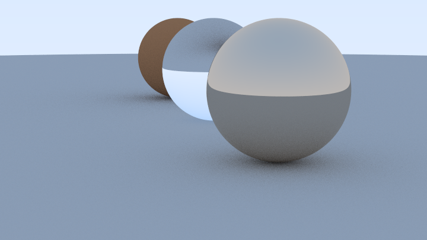
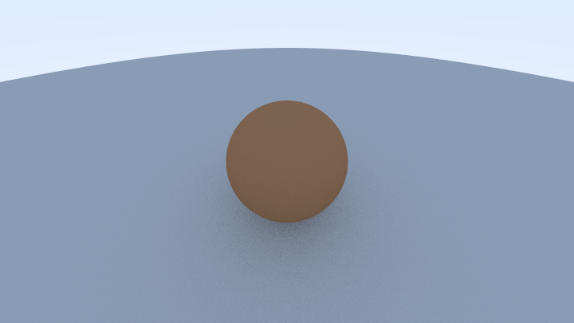
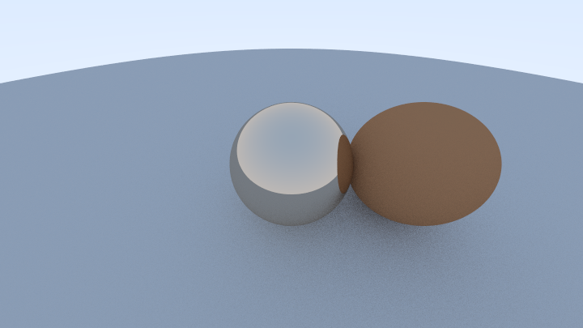
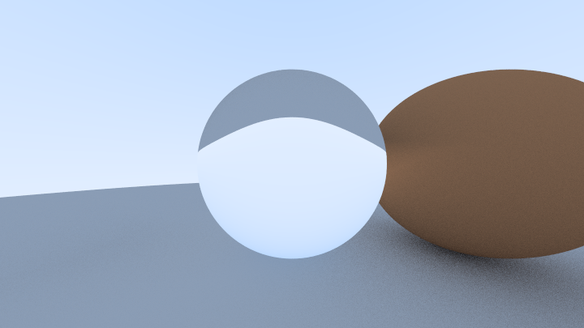
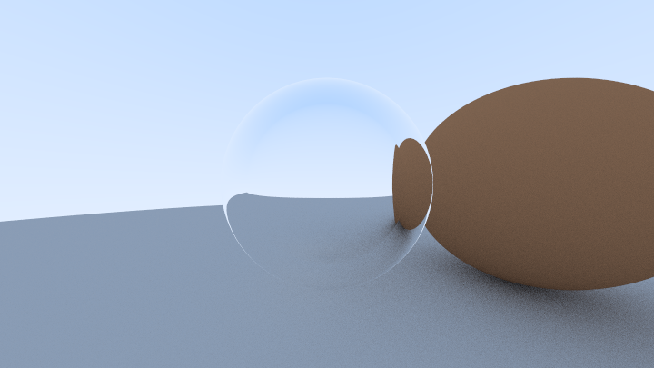
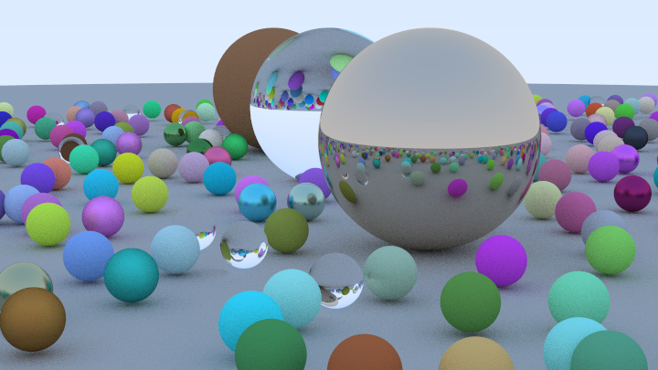

# Howard
Howard is a parallelized ray-tracer written in Haskell based on the "Ray-Tracing in a Weekend" tutorial. Howard is capable of rendering scenes involving metal, lambertian, or dielectric spheres.

## Getting Started
Howard requires Stack to run. To get started run the following command

```
stack setup
stack build
stack exec howard-exe <single?> <scene?> > <imagename>.ppm
```

To run the single-threaded implementation of Howard, include `single` argument when running `stack exec`, otherwise do not include the argument for the parallelized version. To generate one of the given the test scenes, include the name of the scene as an argument. Not including a scene argument will generate the default scene. to output the results to a file, pipe stdout to a ppm file.

## Generating a Test Scene

Howard has 6 test scenes to render

### Default Scene


To generate this scene do not use a scene argument when running `stack exec`

### Lambertian Sphere Scene


To generate this scene use `lambertian` as the scene argument when running `stack exec`

### Metal Sphere Scene


To generate this scene use `metal` as the scene argument when running `stack exec`

### Dielectric Sphere Scene


To generate this scene use `dielectrics` as the scene argument when running `stack exec`

### Hollow Glass Sphere Scene


To generate this scene use `hollow-sphere` as the scene argument when running `stack exec`

### Final Scene


To generate this scene use `final` as the scene argument when running `stack exec`

## Generating a Custom Scene
To generate a custom scene, reconfigure `Main.hs` to define a set of spheres in the world.

### Defining Materials
To define a dielectric surface, construct an instance of the `Dielectric` data type with an index of refraction. To define a lambertian surface, construct an instance of the `Lambertian` data type with a 3-Dimensional color vector. To define a metal surface, construct an instance of the `Metal` data type with a 3-Dimensional color vector and a "fuzziness" constant.
```
        material1 = Dielectric 1.5
        material2 = Lambertian (Vec3 0.4 0.2 0.1)
        material3 = Metal (Vec3 0.7 0.6 0.5) 1.0
        material_ground = Lambertian (Vec3 0.5 0.5 0.5)
```


### Creating Spheres
To create a sphere, construct an instance of the `Sphere` data type with a position vector, radius, and material.

```
        sphere3 = Sphere (Vec3 0 1 0) 1.0 material1
        sphere2 = Sphere (Vec3 (-4) 1 0) 1.0 material2
        sphere1 = Sphere (Vec3 4 1 0) 1.0 material3
        groundSphere = Sphere (Vec3 0 (-1000) 0) 1000 material_ground
```

### Creating a World
To create a world, simply add the defined spheres to a `HittableList`

```
        world = HittableList [sphere1, sphere2, sphere3, groundSphere]
```

### Initializing the Camera
To initialize the camera, initialize its aspect ratio, width, sampling size, field of view (FOV), position, direction to look, and up direction. 

```
        aspectRatio = (16.0/9.0)
        width = 1920
        samples = 100
        vFov = 20
        lookFrom = Vec3 13 2 3
        lookAt = Vec3 0 0 0
        vUp = Vec3 0 1 0

        cam = initialize aspectRatio width samples vFov lookFrom lookAt vUp
```

### Rendering the scene
To render the scene, simply call `renderParallel` or `render` given the defined camera and world

```
        -- Parallel rendering
        renderParallel cam world

        --Single threaded rendering
        render cam world
```